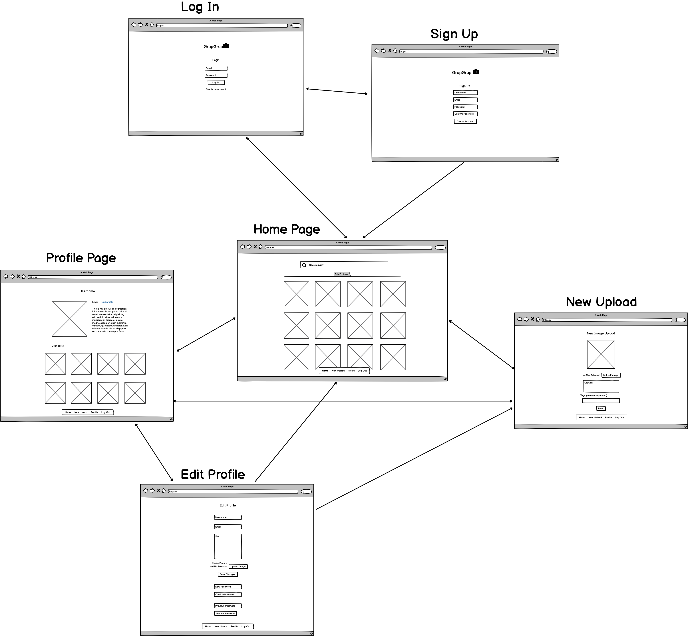

# MERN Stack Final Project

Created by Evelyn Paplauskas and Aaron Lewis for a Coder Academy final project.

## Links

**Main Development Repo:** https://github.com/AaronL1011/MERN-Final-Project

**Front-end Deployed Repo:** https://github.com/evey-pea/GrupGrup-Frontend

**Back-end Deployed Repo:** https://github.com/AaronL1011/GrupGrup-Backend

**Live Application:** https://www.grupgrup.com/

## Application Description

### Purpose

To provide a platform for users to share their original content (photos). Currently many photo sharing platforms allow for the sharing and re-posting of images of any sort. While this is fine, certain audiences would prefer a platform to share images they have taken themselves (photographers, family-persons, etc.) This application can serve as a platform to achieve this. While theoretically you will still be able to upload any image, the whole idea is to keep uploads exclusively as original content.

### Functionality and Features

This application is being designed as a photo sharing platform for use by anyone wishing to upload and distribute their own original photos. Obviously the platform will need functions to support the creation, retrieval, updating and deletion of User Accounts, as well as CRUD operations and a storage solution for the photos being uploaded by each user.

Due to this being a photo-sharing platform, we will need to support file upload and storage. We are hoping to achieve this by utilizing an Amazon S3 Storage Bucket to send and retrieve any data associated to a user.

Users should also be able to modify any of their content on the plaform and visibility to other users, but not each others. This implies the use of some permissions and authentication. We will be able to achieve this with the use of JSON Web Tokens and pre-flight checks of the users token/permissions in relation to any action they are trying to execute.

In a general sense, features we would like to implement include:

- User account management
  - Creation, modification and deletion methods
  - Secure password encryption
- Building collections/albums
  - Uploading and storage of images
  - Meta-tagging
- Search functionality by tag, date, user, etc
- Controllable access to content
  - Public and private settings
  - Sharing collections via posts
  - Blocking/removing unwanted access
  - Retain content when removing access
- Social media platform
  - Ability to share collections via a link for posting on social media platforms
  - Allowing users to follow a user
  - Ability to comment on images publicly and provide feedback privately
  - Reporting of the abuse/violation of Terms of Service

### Libraries used within the Application

> R1 - Uses appropriate libraries

**Back-end Libraries**

- Joi: A schema description language and data validator for Javascript. This library was utlized to validate incoming data for the Signup and Login functionality of the user model.

- Aws-Sdk: The official AWS SDK for JavaScript. This package was required in order to pass image upload data to our S3 bucket for storage.

- Axios: A HTTP request library for javascript. This package was used extensively throughout both the front and back end of the application. Axios allowed us to make data requests between our client and servers in order to actually display any information to the user.

- BcryptJS: An all in one password encryption package for Javascript. This was used to hash the users passwords upon account creation/updating, as well as verify passwords submitted by users on Login.

- Cors: A very important package allowing for Cross Origin Resource Sharing within our application. Without this, access to all our data from the client application would be blocked due to security concerns.

- Dotenv: A simple javascript package that allows for the dynamic setting of environment variables for use within our application. This package was used to store our AWS S3 Keys, our Database access keys, as well as any secret tokens for data validation.

- Express: A minimialist web framework for node. This package is the backbone of our Node API and is used for handling requests from the front-end client, handling data appropriately, and interacting with our Mongo Atlas database and the S3 image storage.

- JSONWebToken: A simple javascript package for the implementation of JSON Web tokens. This was what our User authentication is based off. When a user signs up or logs in, they are assigned a new token which is then stored in LocalStorage. This token is then used for session storage.

- Mongoose: Mongoose is a package designed for the interaction of MongoDB document databases within a node application. This was used to define schemas of our models (Users and Posts), as well as store and retrieve data between the Node API and our Atlas cloud database.

- Multer/Multer-S3: Multer is a node.js middleware for handling multipart/form-data. This was used for handling the requests for making a new post, as files are most commonly uploaded as Multi-part form data, Multer and Multer-S3 where used to pull the image out of the request, upload it to Amazon S3, and return the url for the newly uploaded image to be included in the new Post object.

- Uuidv4: A simple unique ID generator used for the images uploaded to S3. These images required unique identifiers in order to tie them to a post without causing issues with duplicate file urls.

- Mocha/Chai and Chai-Http: A combination of testing frameworks for the automated testing of all the API endpoints. This suite was made to test all valid request cases, as well as all invalid requests, ensuring the correct responses were returned for each case.

**Front-end Libraries**

- Material UI Core/Icons and Lab: Material Ui is a React UI framework full of pre-built, pre-styled components ready to drop into an application. This greatly reduced the workload for the front-end, allowing us to hone our focus into the functionality of each component. Minor styling changes where implemented by each of us to get the componenets sitting appropriately on the page.

- Axios: A HTTP request library for javascript. This package was used extensively throughout both the front and back end of the application. Axios allowed us to make data requests between our client and servers in order to actually display any information to the user.

- Notistack: An all-in-one notification package for Javascript. This neat little package allowed us to wrap our entire application in the Notistack component, and pass success, info or error messages to the user with ease. The notifications are very customizable, and have in-built logic for the displaying and time-out of notifications.

- React: React is an open-source JavaScript library for building responsive and dynamic user interfaces. The entire front-end of our application is built on top of React, which gave us full control over the rendering of data passed through from the back end.

- React Router: React Router is a package designed for the navigation through components of an application. It reads the path from the URL entered by the user or any clicked links, and will render the component assigned to that path.

- Cypress: An end to end testing framework that runs in the browser. This is what we used to test the UI functionality of our application once deployed. It allows us to automate the validation and testing of each function within the front end and record the results of each test.

### Target audience

The target audience within this application is very broad. Given that _any persons who take their own photos_ are encouraged to be a part of this platform, anyone with a camera of some sorts could be considered part of the target audience.

To ensure a safe environment for all users within this application, it may require some Terms and Conditions to be defined to control the specific type of content allowed to be uploaded. For example, imposing restrictions on NSFW content (photos involving nudity, illicit substances or violence) would be required to ensure that any _minors_ or _those who are easily disturbed_ are safe and comfortable within the application.

### Tech Stack

This application is planned to be split into two main components. The 'Front end' will be for rendering content to the users and handling user interaction, and the 'Back end' will be used for routing HTTP requests, and retrieving/sending the appropriate data between servers as the user interacts with the appliocation.

As far as the front end goes, we plan to use technologies such as:

- React: A javascript library for the creation and rendering of responsive web components.
- Netlify/GithubPages: Two hosting platforms that can be used to deploy our React application front end for use in production. Both include some form of free tier, which is ideal for this project, as we would both rather not be paying to host our application if its not necessary.

In regards to the back end, this requires the use of a few more technologies.

- NodeJS: A JavaScript package manager used to link further technologies and create a RESTful API to allow sending and retrieving data between our components.
- ExpressJS: A Javascript Package to implement HTTP request routing so we are able to direct each request to the corresponding destinations.
- MongoDB Atlas: A cloud based NoSQL database solution to allow data persistance of the majority of data within our application (ie Users, Post information, Comments etc.)
- Amazon S3: This is a seperate data storage solution which will be used for holding all of the images uploaded to our application. S3 is much more supportive of larger data sizes, and given each photo uploaded will likely be around a 3-5Mb file size, this will be very neccesary for the operation of our application.
- Heroku: An hosting platform to be used for deploying our RESTful API for access by our application in a production environment.

# Dataflow Diagram

Below is a Level 1 Dataflow Diagram outlining the flow of information between components at the core functionality of the application. It shows how requests from the User are handled and how data is stored and retrieved from our application storage.

# Application Architecture Diagram

Outlined below is the basic Architecture Diagram of how we plan to structure the application. As you can see, the user will always be interacting with our 'front-end' React application. From there, all data/requests are passed through into our 'back-end' NodeJS API where the proper actions can be executed depending on the request type and route destination. Our Node API interacts with numerous javascript packages to allow for functions such as password encryption, web tokens for authentication and Express for routing requests to the correct files/servers, etc. The included 'mongoose' package is our interface between our NodeAPI/Express routes, and our MongoDB Atlas database described below. Express also handles some data storage by sending and retrieving our users images between Amazon S3 and our server application, for delivery to the user.

# User Stories

## Initial User Stories

As a first pass for our user stories, we originally went with a very generic list of stories, mainly to briefly describe some hypothetical needs from our applications users:

**As a user**, I would like to be able to post photos to my profile so my peers can view my content.

**As a user**, I would like to be able to change my account settings easily, in case any of my information changes in the future.

**As a user**, I would like to be able to impose access rights so I can control who can view my photos.

**As a user**, I would like my account and person information to be secure from malicious attack.

While the premise behind these simple stories is accurate, we decided to revise and expand on the user stories by creating unique personas of potential future users of our application. This allowed us to further explore exactly what requirements are requested by our users, and also some context as to why these features are important to them.

## Michael

22 year old college graduate with a major in Computer Science, currently backpacking through Europe with his partner

_"Due to my degree, I have an adept level of experience in the technology field."_

**_"I would like to be able to create a secure account with an encrypted password to protect my personal information from any external entities."_**

"_Security is a crucial point of interest in every application that hosts any form of personal information. Many applications aren't very transparent with the level of security used to protect my information, so I would like to be informed on the methods used within this application.
"_

## Karen

47 year old mother of 3 'angelic' children, freshly returned from arguing with the Branch Manager of her local Woolworths.

_"Due to my priorities in life revolving around fighting employees of local businesses, my experience with technology is limited to recording arguments in case I need evidence in a court case."_

_"I want to be able to quickly and easily change my account information if any of my details change in the future."_

**\*"Some current applications make it too complicated to find where to edit my information, which quite frankly I find confusing and irritating. I would prefer this process to be very simple and intuitive**, so I can spend more time with my children instead of writing aggressive emails to the app developers."\*

## Alex

32 year old circus clown from Idaho, currently honing his juggling and animal training skills.

_"My experience in life is entirely made up of the circus, consequently technology can be rather confuddling."_

_"I want to be able to upload photos of my animal training progress and remove them if they prove to be risque for the public eye."_

\*"Other platforms sometimes make it tricky to find where to delete my photos when my audience dislikes certain content. **I would like manage how my photos are publicly viewed to help me maintain my personal brand without having to resort to deleting them."\***

## Anita

55 year old empty-nester. Currently travelling around Australia in a caravan with her partner Brian

Her experience with technology stems from working in administration of small businesses prior to hI thought that using avatars would be less problematic than er retirement

**_“I would like to be able to organise her photos from our journey to share with friends and family”_**

_“I find that other platforms I have used such as flickr and instagram are either too structured or not structured enough, as well as taking too long and too much effort to do what I want to do”_

## Sanjay

33 year old newly immigrated father of two. He wants to easily share photos of his young family with family back home in India

_“I mostly use facebook and instagram but have never used a dedicated photo album style platform.”_

_“I am very technically literate due to my skills as a software engineer. Speed to sharing and an easy learning curve are what I look for before attempting to adopt anything”_

_“**I like base my platforms of choice on ease of usability for those I want to share my photos with**, many of whom are not that skilled with using complex software”_

_“I am wanting something simpler and more powerful than albums or single posts **that does not ask too much of my time from my very busy family and work life**”_

### Alice

48 year old sister-girl from the Northern Territory who is active in social campaigning. She regularly attends demonstrations in the large capital cities and often returns to her 'home country' to see her family and friends

_“I have only really used facebook”_

**_“I would like to share photos of my life and of what I do with my activism. These are the stories of mine which are important to me. I need to be able to tell them to my community, friends and organisations that I am involved with”_**

_“I am after something simple that lets me share my images and stories as facebook feels a little too crowded with unrelated content”_

# Wireframes

### Log In

This is the page that users are greeted with upon first visit of the application. Users are required to sign in to their account in order to use certain functions of the application such as posting and commenting.

### Sign Up

This page sports a form for users to create their own account! This allows them to upload photos and share with friends, view other peoples posts, and make comments!

### Home Landing Page

This is the home page of the application, here users are able to enter search queries, view their general feed and change the view layout, and navigate the application with the bottom navbar.

The layout will be available in 2 forms: Grid View and Linear. Selecting the layout will be accomplished by using the selector below the search bar

**Grid layout**

**Linear layout**

### New Upload Page

From this form screen users are able to upload new photos to share on their profiles. The form takes a new file upload, along with a caption and any tags specified by the user.

### Profile View

This is where users can see their own profiles and how they look to other users, as well as access to edit their information if they have the permissions to do so.

### Edit Profile Page

This page has forms allowing for the user to change their account details and reset their password if need be.

## Sitemap / Relationships

Outlined below are the relationships between each page. Most pages can be access from one another with the exception of Sign Up and Edit Profile, due to the navigation bar at the bottom of the screen.

# Planning Screenshots

Throughout the developement process, we opted to use Kanban progress tracking in the form of a Trello board. This makes it exceedingly simple to visualise the status of each current task, and to follow who is completing each one. As each task is progressed, it moves between columns, once completed, it is marked as such, and a new task can be commenced. Outlined below, you can see the progression of tasks as we worked through the first section of the assignment.

### Planning phase

### Development phase

> R3 - Use a recognised project management methodology

> R4 - Use a recognised task delegation methodology

During the development phase of our project, we made use of a Complexity vs Priority task management system, color coding each card in our Trello board with a label corresponding to the defined key. Tasks where delegated by where we felt our strongest skills fit best, and names where assigned to task cards as we saw fit.

